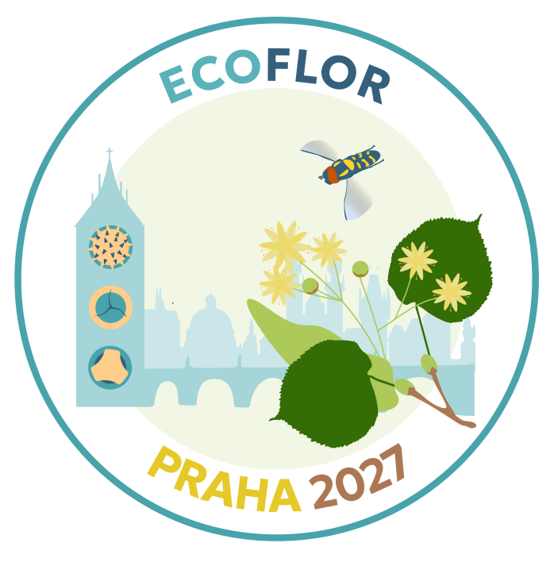
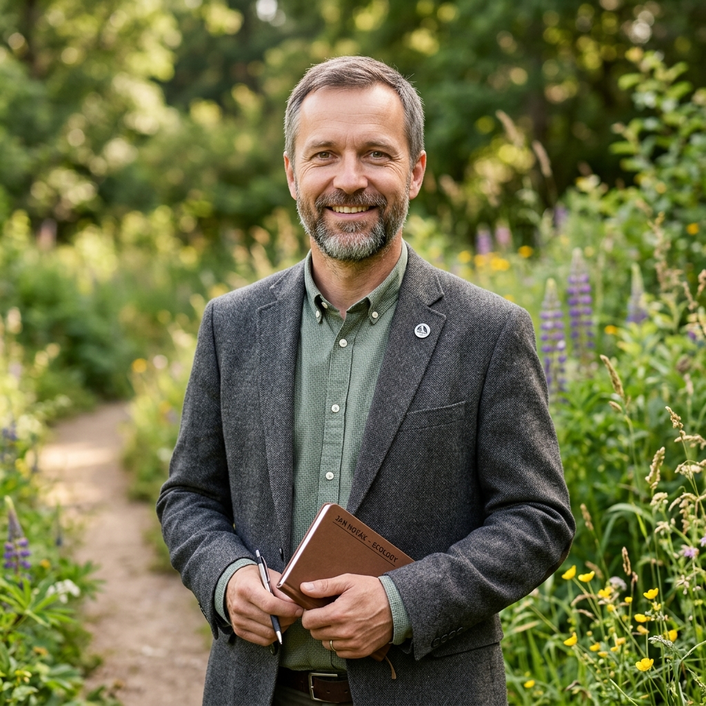
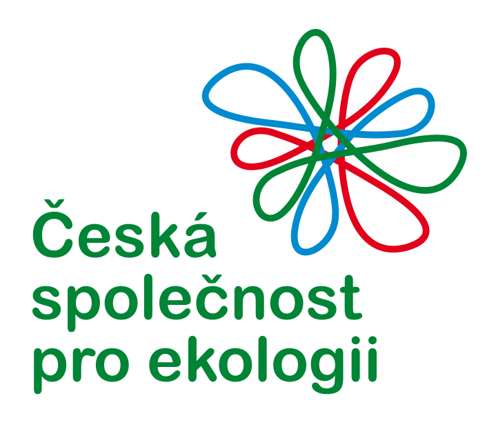
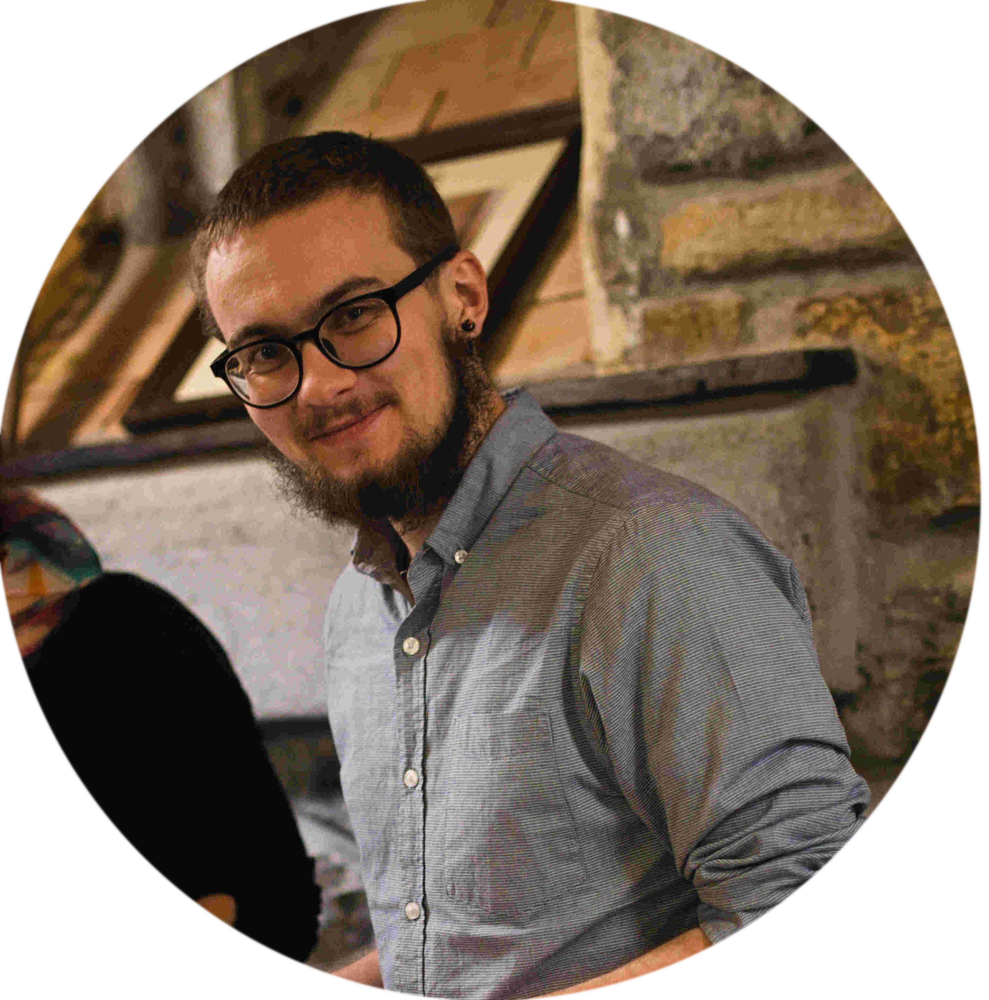
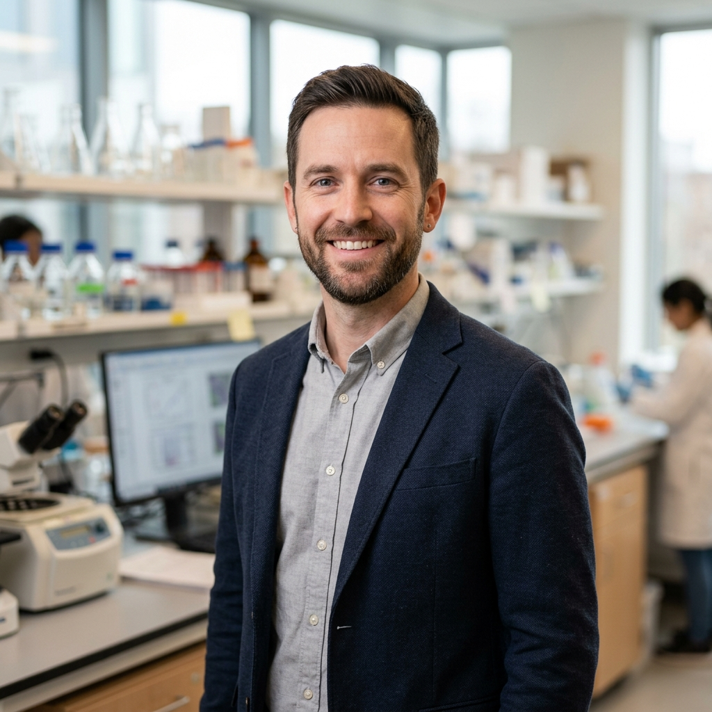
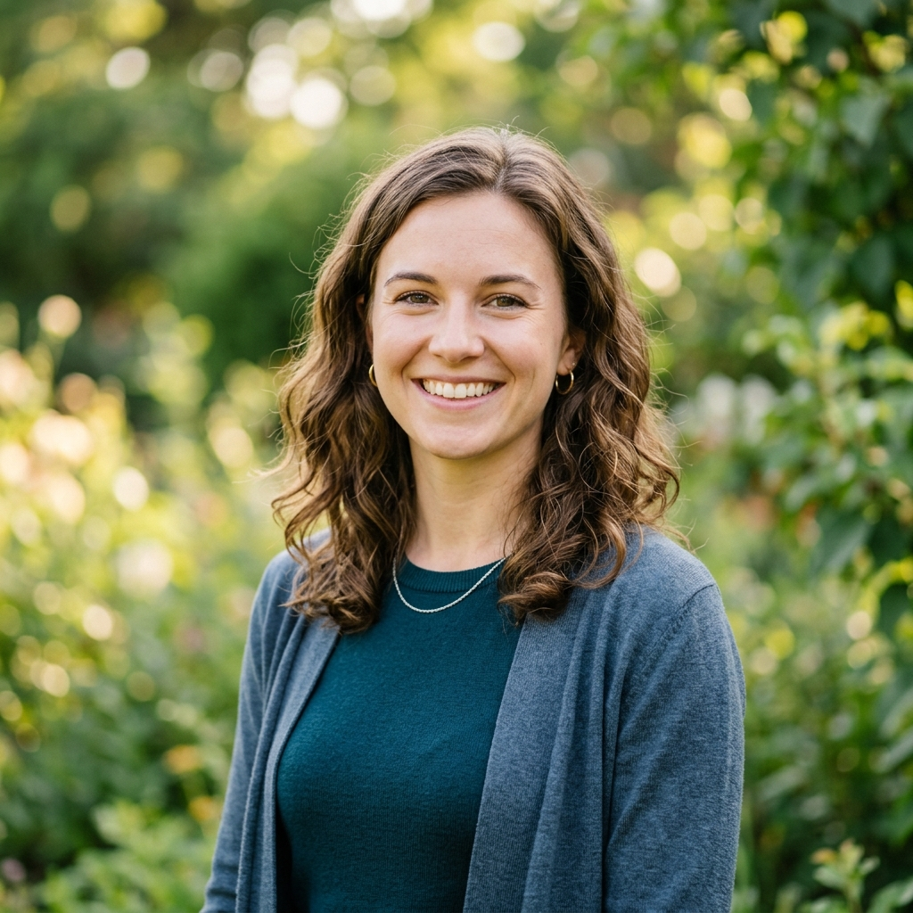

<meta name="description" content="ECOFLOR 2027 – 24th Annual Meeting of the Floral Ecology and Evolution Working Group, 3–6 February 2027, Přírodovědecká fakulta UK, Praha (Prague), Czech Republic." />
<meta name="keywords" content="ECOFLOR 2027, floral ecology, pollination, Praha, Prague, conference, plant-pollinator" />

{fig-align="center" width="600"}

::: {#about style="text-align: center;"}
## About
:::

::::: {style="text-align: justify;"}
::: {#welcome style="text-align: center;"}
**Welcome to the 24th Annual Meeting of the Floral Ecology and Evolution Working Group – ECOFLOR 2027!**
:::

We are delighted to announce the **24th Annual Meeting of ECOFLOR**, which will take place from **3–6 February 2027** in [**Praha (Prague)**](https://en.wikipedia.org/wiki/Prague), Czech Republic, hosted by the [**Faculty of Science, Charles University**](https://www.natur.cuni.cz/eng) (Přírodovědecká fakulta UK).

EcoFlor is a working group of the [**Spanish Association of Terrestrial Ecology (AEET)**](https://www.aeet.org/es/english/). It organises an annual congress to discuss recent scientific findings on floral ecology and evolution. For the first time, the 2027 meeting moves to Central Europe, bringing together researchers from across the world in the heart of one of Europe's most beautiful cities.

The EcoFlor annual meeting brings together scientists interested in floral ecology and evolution. Its goal is to promote discussion, networking, and creativity in science, involving students at all career stages in an open and friendly environment. Participants are invited to present their ongoing projects and engage in critical scientific discussion and networking.

The meeting will feature **two days of presentations** including plenary talks by **Prof. Robert Tropek** and **Dr Katherine Baldock**, as well as oral and poster contributions, thematically organised based on submitted abstracts.

In addition, there will be an **excursion on Saturday 6th February** to the [Milovice Nature Reserve](https://en.wikipedia.org/wiki/Milovice_Nature_Reserve) to see the reintroduced **European Bison** (*Bison bonasus*) and other large herbivores in the Czech wild steppe.

All contributions should be in **English** to promote discussion and interaction with our international audience.

### Meeting information summary {style="text-align: center;"}

::: {style="text-align: left;"}
📅 **3–6 February 2027**

📍 [Přírodovědecká fakulta UK, Praha](https://www.natur.cuni.cz/eng) – lecture hall to be announced

🎤 Plenary speakers: [Prof. Robert Tropek] & [Dr Katherine Baldock]

🦬 [Excursion] to Milovice Nature Reserve on **Saturday 6th February**

🍻 Conference dinner – during the meeting (free attendance; dinner details TBD)

✉️ [Registration] – **opens soon**

📞 [Contact](#contact) via [email](mailto:ecoflor2027@gmail.com)

:::
:::::

---

<div>

::: {#registration style="text-align: center;"}
## Registration
:::

</div>

:::::::::::: {style="style"}
::: {style="text-align: center;"}
### Registration is not yet open
:::

:::::::::: {#registration_info style="text-align: justify;"}
::: {style="text-align: center;"}
#### Registration and Contributions
:::

Attendance at the meeting is **free**, but registration is **mandatory** for logistical reasons. Please fill out the form once it opens if you plan to attend.

When registering, you can also submit a proposal for an **oral** or **poster** presentation. Awards will be given for the **best oral** and **best poster** presentations.

We also welcome proposals for **Rising Stars talks** — slightly longer presentations aimed at early-career researchers with exciting research to showcase. These are a great opportunity to present a broader research line, a breakthrough idea, or an emerging topic in more depth than a standard oral presentation allows.

We also welcome proposals for **workshops** to be held on the first day of arrival (Tuesday 3rd February). We especially encourage workshops that help early-career researchers develop skills, such as fieldwork methods, sample processing, laboratory protocols, data analysis, and scientific writing. Discussions on emerging topics and networking opportunities are also welcome!

::: {style="text-align: center;"}
#### Important Note
:::

The meeting has a **limited number of places**. Acceptance will be based on a combination of factors: order of registration, whether you submit a contribution, and scientific scope. We highly encourage young researchers to submit their contributions, as the scientific committee will give them priority.

::: {style="text-align: center;"}
#### Preparing Your Abstract
:::

Please submit your abstract in **English** during the registration process. The abstract should **not exceed 200 words**. When submitting, also provide **five keywords** to help us organise conference sessions.

Each main author may submit only **one contribution**. We kindly request that the main author is the one submitting the abstract.

::: {style="text-align: center;"}
#### Oral Presentations
:::

Oral presentations will be **10 minutes long**; slides should be in English.

::: {style="text-align: center;"}
#### Poster Presentations
:::

Posters will be displayed throughout the conference. Poster sessions will take place during coffee breaks: a 30-minute session in the morning and a one-hour session in the afternoon, specifically designed to encourage discussion and networking.

::::::::::
::::::::::::

::::::::::::: {#programme}
## Programme {style="text-align: center;"}

::: {style="text-align: center;"}
🗓 The full programme will be announced after the registration deadline.
:::

::: {.placeholder-notice}
📋 **Placeholder** — Programme details will be added once abstracts are collected.
:::

:::::::::::::

---

::: {#speakers style="text-align: center;"}
## Plenary Speakers
:::

:::::: {.speaker-card}
{.speaker-photo fig-alt="Prof. Robert Tropek"}

:::: {style="text-align: center;"}
#### doc. Robert Tropek [{width="22"}](https://scholar.google.com/citations?user=YOUR_ID)

#### Floral ecology and pollination in disturbed landscapes
::::

::: {style="text-align: justify;"}
Robert Tropek is a Professor at the [**Institute of Entomology, Czech Academy of Sciences**](https://www.entu.cas.cz/en/) and at the [**Faculty of Science, Charles University in Prague**](https://www.natur.cuni.cz/eng). His research focuses on the ecology and conservation of insects in disturbed habitats, including post-industrial areas, post-mining sites, and post-fire landscapes. He is particularly interested in how disturbance and succession drive plant–pollinator interactions and biodiversity in Central European landscapes. Robert has published extensively on pollinator conservation, habitat management, and the underestimated value of "novel ecosystems" for biodiversity.

::: {.placeholder-notice}
📝 **Placeholder bio** — Full bio and talk title to be confirmed.
:::
:::
::::::

:::::: {.speaker-card}
{.speaker-photo fig-alt="Dr Katherine Baldock"}

:::: {style="text-align: center;"}
#### Dr Katherine Baldock [{width="22"}](https://scholar.google.com/citations?user=YOUR_ID)

#### Urban pollinators: patterns, drivers and conservation
::::

::: {style="text-align: justify;"}
Katherine Baldock is a researcher at the [**University of Bristol**](https://www.bristol.ac.uk/), UK, specialising in urban ecology and pollination biology. Her landmark research — including the [UK National Pollinator Monitoring Scheme](https://www.ukpoms.org.uk/) and multiple urban flower resource assessments — has fundamentally shaped our understanding of how cities can support wild bee and pollinator communities. She investigates the role of urban green spaces, street verges, gardens, and parks in providing floral resources and supporting healthy pollinator populations across urban gradients.

::: {.placeholder-notice}
📝 **Placeholder bio** — Full bio and talk title to be confirmed.
:::
:::
::::::

---

::: {#excursion style="text-align: center;"}
## Excursion: European Bison at Milovice
:::

::: {style="text-align: justify;"}
The conference excursion will take place on **Saturday 6th February 2027**. We will visit the [**Milovice Nature Reserve**](https://en.wikipedia.org/wiki/Milovice_Nature_Reserve), located approximately 40 km east of Prague, where you can encounter **European Bison** (*Bison bonasus*), **Exmoor Ponies**, and **Konik horses** roaming freely in a rewilded Czech steppe landscape.

The Milovice reserve is one of Central Europe's most exciting rewilding projects — a former military training area that has been transformed into a haven for large herbivores and grassland biodiversity. The project is run by the [**European Wildlife Foundation**](https://www.european-wildlife.eu/) and serves as a flagship example of large-scale rewilding in Central Europe.

From the perspective of floral ecology, the reserve is a remarkable case study: the grazing and browsing by large herbivores shapes plant communities, floral diversity, and pollinator habitats across the steppe grasslands.

::: {style="text-align: center;"}
🦬 Further details (transport, timing, costs) will be provided to registered participants.
:::

:::

::: {.placeholder-notice}
📋 **Placeholder** — Excursion logistics (departure time, transport, any costs) to be confirmed.
:::

```{=html}
<iframe src="https://www.google.com/maps/embed?pb=!1m18!1m12!1m3!1d10290.512!2d14.7237!3d50.2248!2m3!1f0!2f0!3f0!3m2!1i1024!2i768!4f13.1!3m3!1m2!1s0x470be2fde7ae1b3b%3A0x8b13fba9f9ecb3a!2sMilovice%20Nature%20Reserve!5e0!3m2!1sen!2scz!4v1695000000000" width="100%" height="380" style="border:0; border-radius:12px; box-shadow: 0 4px 16px rgba(0,0,0,0.1);" allowfullscreen loading="lazy" referrerpolicy="no-referrer-when-downgrade"></iframe>
```

---

:::: :::::::::
::: {#venue style="text-align: center;"}
## Venue
:::
::::

:::::::::: :::::::::
::::::::: {style="text-align: justify;"}
::: {style="text-align: center;"}
**Welcome to PRAGUE / PRAHA!**
:::

The 24th edition of EcoFlor takes place at the **[Přírodovědecká fakulta UK](https://www.natur.cuni.cz/eng)** (Faculty of Science, Charles University), located at **Viničná 7, Praha 2** — in the heart of Prague, just minutes from the historic city centre.

The specific lecture hall will be announced to registered participants. Oral presentations (including plenary talks) and poster sessions will both be held within the faculty building.

::: {style="text-align: center;"}
### Transportation
:::

**By plane:** Prague's [Václav Havel Airport](https://www.prg.aero/en) is well connected to major European cities. From the airport, take **Bus 119** to the metro terminus *Nádraží Veleslavín* (line A, green), then take the metro to *Náměstí Míru* (about 20 minutes total). From there it is a short walk to Viničná 7.

> ⚠️ **Avoid the Airport Express bus** — it is significantly overpriced for what it offers and offers no real advantage over the standard public transport connection, which is fast, frequent, and cheap. **Taxis and ride-hailing services from the airport are also notoriously expensive** — Prague's public transport will get you to the venue faster and for a fraction of the cost.

**By train:** Prague's main station (*Praha Hlavní nádraží*) has excellent connections from across Central Europe (Vienna, Budapest, Berlin, Warsaw). From the station, take metro line C (red) direction *Háje*, alight at *I. P. Pavlova* — the faculty is a 5-minute walk.

**By metro:** The closest metro stops are:

- 🟢 **Náměstí Míru** (Line A, green) – 7 min walk
- 🔴 **I. P. Pavlova** (Line C, red) – 7 min walk

**Tickets — use the Lítačka app:** Prague's public transport (operated by [PID](https://pid.cz/en/)) is excellent, affordable, and runs 24 hours. The easiest way to buy tickets is the **[PID Lítačka](https://app.pidlitacka.cz/)** mobile app (available for [Android](https://play.google.com/store/apps/details?id=cz.dpp.praguepublictransport) and [iOS](https://apps.apple.com/cz/app/pid-l%C3%ADta%C4%8Dka/id1140104120)). You can buy single-ride tickets, time passes, and airport zone supplements directly in the app and activate them instantly — no need to find a ticket machine. A **24-hour ticket** costs ~120 CZK (~5 EUR) and is valid on all metro, tram, and bus lines. Tickets can also be purchased from machines at metro stations or by SMS.

```{=html}
<iframe src="https://www.google.com/maps/embed?pb=!1m18!1m12!1m3!1d2561.2!2d14.4265!3d50.0737!2m3!1f0!2f0!3f0!3m2!1i1024!2i768!4f13.1!3m3!1m2!1s0x470b94e6d86c3a3d%3A0x1f8d8d5a1b6c7e90!2sPr%C3%ADrodov%C4%9Bdeck%C3%A1%20fakulta%20UK!5e0!3m2!1sen!2scz!4v1695000000000" width="100%" height="420" style="border:0; border-radius:12px; box-shadow: 0 4px 16px rgba(0,0,0,0.1);" allowfullscreen loading="lazy" referrerpolicy="no-referrer-when-downgrade"></iframe>
```

::: {style="text-align: center;"}
### Where to stay
:::

Prague has a wide range of accommodation options at various price points. We recommend booking **well in advance** as February can be busy with winter tourism.

Some options near the venue:

- 🏨 [Hotel Ariston](https://www.ariston.cz/) – close to Náměstí Míru, comfortable 3-star
- 🏨 [Hotel Luník](https://www.lunik.cz/) – quiet location near I. P. Pavlova metro
- 🏠 Airbnb/apartments in **Vinohrady** or **Žižkov** neighbourhoods – charming, walkable, good local restaurants

For budget-conscious participants, hostels in the **Žižkov** and **Vinohrady** neighbourhoods offer great value and are close to the venue. More options can be found on [booking.com](https://www.booking.com) or [hotels.com](https://www.hotels.com).

::: {style="text-align: center;"}
### What to do in Prague
:::

Prague is a spectacular city with a wealth of history, culture, and gastronomy. The faculty is located in the vibrant **Vinohrady** district, known for its Art Nouveau architecture, parks, and excellent local restaurants and wine bars.

Nearby highlights include **Náměstí Míru** square, **Riegrovy sady** park (great city views), the **National Museum**, and the famous **Wenceslas Square**. The **Old Town**, **Charles Bridge**, and **Prague Castle** are 20–30 minutes away by metro or tram.

::: {style="text-align: center;"}
### Honest Guide to Prague 🎥
:::

::: {style="text-align: justify;"}
We recommend the **Honest Guide** YouTube channel, run by local journalists Janek Rubeš and Honza Mikulka. Their videos give practical, honest advice for navigating Prague like a local — avoiding tourist traps, finding the best food and beer, and getting around safely and cheaply.
:::

::::::::: columns

::: {.column .video-col width="50%"}
```{=html}
<div class="video-wrapper">
  <iframe src="https://www.youtube.com/embed/WJou7DxdP4o" title="Honest Prague Guide – The Only Video You Need" allowfullscreen></iframe>
</div>
```
::: {.video-label}
🗺️ **The Essential Prague Guide** – everything you need to know
:::
:::

::: {.column .video-col width="50%"}
```{=html}
<div class="video-wrapper">
  <iframe src="https://www.youtube.com/embed/Sz_kXQ-Z0Ew" title="Best of Prague in 4 Hours" allowfullscreen></iframe>
</div>
```
::: {.video-label}
🏰 **Best of Prague in 4 Hours** – top sights walking route
:::
:::

:::::::::

::::::::: columns

::: {.column .video-col width="50%"}
```{=html}
<div class="video-wrapper">
  <iframe src="https://www.youtube.com/embed/OMbCsMObyfQ" title="Prague Public Transport Guide" allowfullscreen></iframe>
</div>
```
::: {.video-label}
🚇 **Public Transport in Prague** – how to buy tickets & get around
:::
:::

::: {.column .video-col width="50%"}
```{=html}
<div class="video-wrapper">
  <iframe src="https://www.youtube.com/embed/DMZLvgAGx3A" title="Worst Scam in Prague – Honest Guide" allowfullscreen></iframe>
</div>
```
::: {.video-label}
⚠️ **Prague Scams to Avoid** – currency exchange & tourist traps
:::
:::

:::::::::

::: {style="text-align: center;"}
### Where to eat and drink
:::

Prague has an outstanding food and beer scene. Near the venue in **Vinohrady** and **Žižkov**, you will find:

- 🍺 **Riegrovy sady beer garden** – iconic outdoor beer garden with city views (seasonal, may be cold in February!)
- 🍺 **Vinohradský pivovar** – excellent craft brewery restaurant
- 🍽 **Lokál Vinohrady** – legendary Czech pub food and Pilsner Urquell served perfectly
- 🍽 **Café Sladkovský** – neighbourhood favourite for coffee and food
- 🥩 **Maso a Kobliha** – butcher-restaurant with exceptional local Czech ingredients

Further recommendations will be shared with registered participants.
:::::::::
::::::::::

---

:::: :::::::::
::: {#organisation style="text-align: center;"}
## Organisation Committee
:::
::::


::: {style="text-align: justify;"}
The 24th edition of EcoFlor is organised by researchers based at the **[Faculty of Science, Charles University](https://www.natur.cuni.cz/eng)** (Praha, Czech Republic) in cooperation with the **[Česká společnost pro ekologii](https://www.cspe.cz/)** (Czech Society for Ecology, ČSPE).
:::

\

::: {style="text-align: center;"}
[{width="220" fig-alt="Česká společnost pro ekologii (ČSPE)"}](https://www.cspe.cz/)

**[Česká společnost pro ekologii (ČSPE)](https://www.cspe.cz/)** is an independent civic association uniting scientists, academics, students, and other professionals working in the field of ecology in the Czech Republic. It supports ecological research, education, and public engagement with ecological science.
:::

\

::::::: columns
::: {.column width="40%"}
{fig-align="left" width="200"}
:::

::::: {.column width="60%"}
##### Jakub Štenc

::: {style="text-align: justify;"}
Postdoctoral researcher at the [Faculty of Science, Charles University](https://www.natur.cuni.cz/eng) (Departments of Botany and Zoology, Praha, Czech Republic). He is an ecologist with expertise in plant–pollinator interactions, with particular interest in the dynamics of pollen presentation, transfer and deposition, consequences of pollinator behaviour (preferences and constancy) for pollination networks, and automatisation of image analysis.
:::

::: {style="text-align: center;"}
[✉️](mailto:jakubstenc@gmail.com) [{width="25"}](https://scholar.google.com/citations?user=QrFO4O0AAAAJ&hl=cs) [CV](https://jakubstenc.github.io/jakubstenc/CV.html)
:::
:::::
:::::::

\

::::::: columns
::: {.column width="40%"}
{fig-align="left" width="200"}
:::

::::: {.column width="60%"}
##### Name Surname *(TBD)*

::: {style="text-align: justify;"}
::: {.placeholder-notice}
📝 **Placeholder** — Bio and affiliation to be confirmed.
:::
:::
:::::
:::::::

\

::::::: columns
::: {.column width="40%"}
{fig-align="left" width="200"}
:::

::::: {.column width="60%"}
##### Name Surname *(TBD)*

::: {style="text-align: justify;"}
::: {.placeholder-notice}
📝 **Placeholder** — Bio and affiliation to be confirmed.
:::
:::
:::::
:::::::

\

::::::: columns
::: {.column width="40%"}
{fig-align="left" width="200"}
:::

::::: {.column width="60%"}
##### Name Surname *(TBD)*

::: {style="text-align: justify;"}
::: {.placeholder-notice}
📝 **Placeholder** — Bio and affiliation to be confirmed.
:::
:::
:::::
:::::::

\

::::::: columns
::: {.column width="40%"}
{fig-align="left" width="200"}
:::

::::: {.column width="60%"}
##### Name Surname *(TBD)*

::: {style="text-align: justify;"}
::: {.placeholder-notice}
📝 **Placeholder** — Bio and affiliation to be confirmed.
:::
:::
:::::
:::::::


:::: {#acknowledgements}
## Acknowledgements {style="text-align: center;"}

::: {style="text-align: center;"}
::: {.placeholder-notice}
🙏 **Placeholder** — Sponsors and supporting organisations to be announced. We are grateful to all institutions that support this meeting.
:::
:::
::::

:::: {#contact}
## Contact {style="text-align: center;"}

::: {style="text-align: center;"}
[**ecoflor2027@gmail.com**](mailto:ecoflor2027@gmail.com)

For questions about the meeting, abstract submission, registration or logistics, please reach out by email.

::: {.placeholder-notice}
📱 **Placeholder** — Social media accounts (Instagram, Bluesky, WhatsApp group) for ECOFLOR 2027 to be set up and linked here.
:::
:::
::::